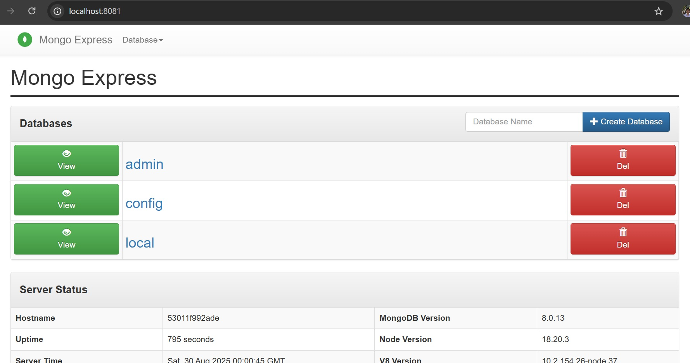
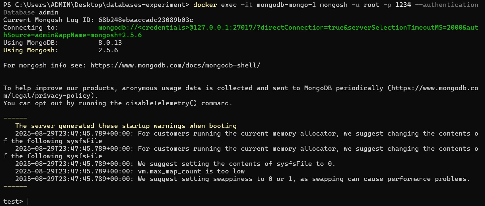
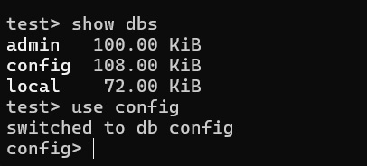
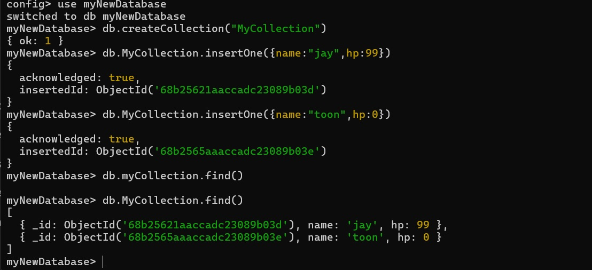

## Why use Mongo? 

MongoDB is a NoSQL document database.

https://www.reddit.com/r/webdev/comments/pkxkcd/when_should_i_actually_use_mongodb/

## Exploring UI
After spin up mongo, there are three default databases.
- **admin**  Used for administrative tasks like user management.  
- **local**  Stores local server data, replication info, and operational metadata.  
- **config**  Used by sharded clusters to store metadata.  

## Using CLI Commands

Use docker exec to get into the container.
The `mongosh` let me into execute mongo cli commands.

Note that `test>` is just a general context.  
We can use `use <db name>` command to switches.

It will auto create a new database if not exists.  
Below I create a collection, insert data and query it.

## Users and Roles

In Mongo, users are stored in a specific database (authentication DB).

Roles define what the user can do per database.

You log in via the authentication database, then your roles determine access elsewhere.