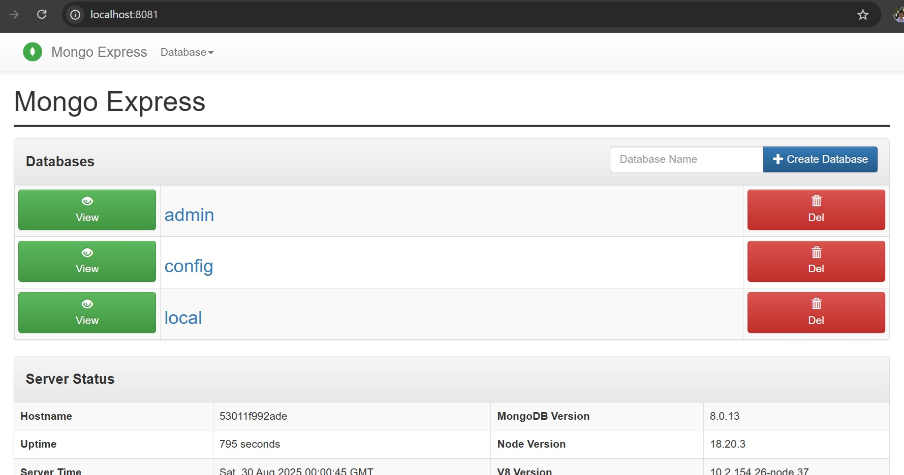

## Why use Mongo? 

MongoDB is a NoSQL document database. In most cases, if performance or scalability is not the limiting factor, people reach for a relational database (RDBMS) first.

If we want NoSQL it depending on how our application interact with data. 

https://www.reddit.com/r/webdev/comments/pkxkcd/when_should_i_actually_use_mongodb/

## Exploring UI
After spin up mongo, there are three default databases.
- **admin**  Used for administrative tasks like user management.  
- **local**  Stores local server data, replication info, and operational metadata.  
- **config**  Used by sharded clusters to store metadata.  

## Using CLI Commands

Use docker exec to get into the container.
The `mongosh` let me into execute mongo cli commands.

Note that `test>` is just a general context.  
We can use `use <db name>` command to switches.

It will auto create a new database if not exists.  
Below I create a collection, insert data and query it.

## Users and Roles

In Mongo, users are stored in a specific database (authentication DB).

Roles define what the user can do per database.

You log in via the authentication database, then your roles determine access elsewhere.

## Python with MongoDB

source: https://www.mongodb.com/docs/languages/python/pymongo-driver/current/

## Cloud based MongoDB

MongoDB Atlas is the official managed cloud service provided by MongoDB, Inc.

The way we interact with it still the same (`pymongo` for python and `mongosh` for CLI).

Querying and app code experience is nearly identical, but operations/admin tasks shift to the Atlas console.