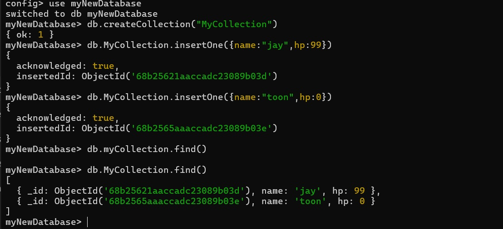

## Why use Mongo? 

MongoDB is a NoSQL document database. In most cases, if performance or scalability is not the limiting factor, people reach for a relational database (RDBMS) first.

If we want NoSQL it depending on how our application interact with data. 

https://www.reddit.com/r/webdev/comments/pkxkcd/when_should_i_actually_use_mongodb/

## Exploring UI
After spin up mongo, there are three default databases.
- **admin**  Used for administrative tasks like user management.  
- **local**  Stores local server data, replication info, and operational metadata.  
- **config**  Used by sharded clusters to store metadata.  

## Using CLI Commands

Use docker exec to get into the container.
The `mongosh` let me into execute mongo cli commands.

Note that `test>` is just a general context.  
We can use `use <db name>` command to switches.

It will auto create a new database if not exists.  
Below I create a collection, insert data and query it.

## Users and Roles

In Mongo, users are stored in a specific database (authentication DB).

Roles define what the user can do per database.

You log in via the authentication database, then your roles determine access elsewhere.

## Python with MongoDB

source: https://www.mongodb.com/docs/languages/python/pymongo-driver/current/

Detail experiment is in the `mongo.ipynb` file.

Note that, Unlike SQL databases, which take queries as strings, MongoDB uses PyMongo’s functions for querying.

For example, we use `collection.find()` instead of passing the string `"SELECT * FROM collection"` to execute.

### Basic Reads
- `collection.find()` → all documents (`SELECT *`)
- `collection.find_one()` → first matching document (`SELECT * ... LIMIT 1`)
- `collection.find({"age": 30})` → filter (`WHERE age = 30`)

### Comparison Operators
- `{"age": {"$gt": 30}}` → age > 30
- `{"age": {"$lt": 30}}` → age < 30
- `{"age": {"$gte": 18, "$lte": 65}}` → 18 ≤ age ≤ 65
- `{"name": {"$in": ["Alice", "Bob"]}}` → name IN ("Alice","Bob")

### Logical Operators
- `{"$and": [{"age": {"$gt": 18}}, {"city": "NY"}]}` → AND
- `{"$or": [{"age": {"$lt": 18}}, {"city": "LA"}]}` → OR
- `{"age": {"$ne": 30}}` → age != 30

### Projections (select specific fields)
- `collection.find({}, {"name": 1, "age": 1, "_id": 0})`  
  → return only `name` and `age` (exclude `_id`)

### Sorting & Limiting
- `collection.find().sort("age", 1)` → sort ascending by age  
- `collection.find().sort("age", -1)` → sort descending  
- `collection.find().limit(5)` → first 5 documents

### Inserts
- `collection.insert_one({"name": "Alice", "age": 25})`  
- `collection.insert_many([...])`

### Updates
- `collection.update_one({"name": "Alice"}, {"$set": {"age": 26}})`  
- `collection.update_many({"city": "NY"}, {"$inc": {"age": 1}})`

### Deletes
- `collection.delete_one({"name": "Alice"})`  
- `collection.delete_many({"city": "LA"})`

## Cloud based MongoDB

MongoDB Atlas is the official managed cloud service provided by MongoDB, Inc.

The way we interact with it still the same (`pymongo` for python and `mongosh` for CLI).

Querying and app code experience is nearly identical, but operations/admin tasks shift to the Atlas console.