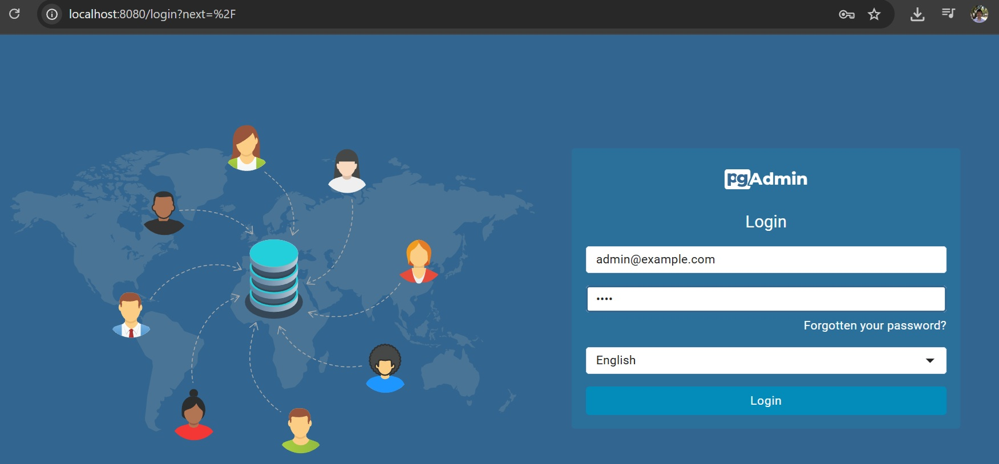
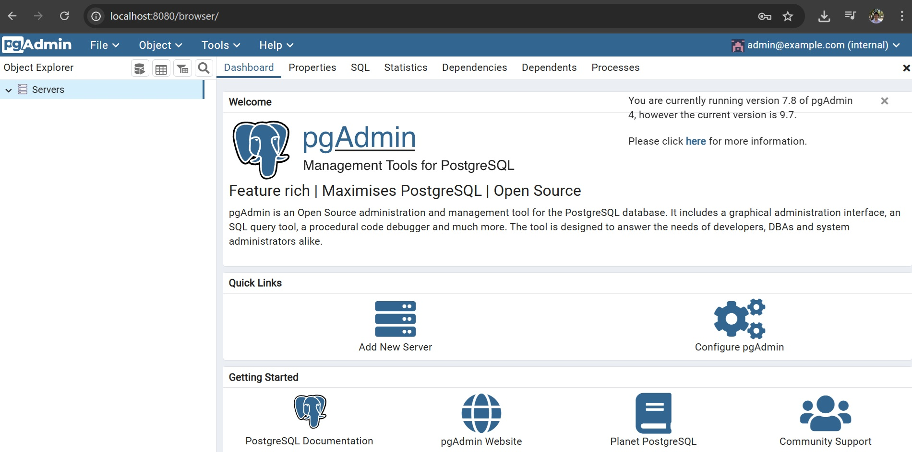

## Why use PostgreSQL? 

PostgreSQL is one of the most popular, production grade relational database management system (RDBMS).

## Exploring UI

## Using CLI Commands

Use docker exec to get into the container.

Connect to a database as a specific user
`psql -h <host> -p <port> -U <username> -d <database>`

Connect to default database with default user
`psql`

-- List all databases `\l`

-- Connect to a database `\c <database_name>`

-- List all tables in the current database `\dt`

-- Describe a table `\d <table_name>`

-- Exit psql `\q`

## Users and Roles

Roles in PostgreSQL can be users (login roles) or groups (roles without login).

## Python with PostgreSQL

source: https://pynative.com/python-postgresql-tutorial/

Detail experiment is in the `postgres.ipynb` file.

I've written an article about how silly error happened while I try to connecting to postgres inside container: https://dev.to/jaykape/the-long-hunt-for-a-dockerized-postgresql-connection-kon

## Cloud based PostgreSQL

Each main public cloud provide a relational database that run PostgreSQL engine.  
(AWS=RDS, GCP=Cloud SQL, Azure=Azure Database)